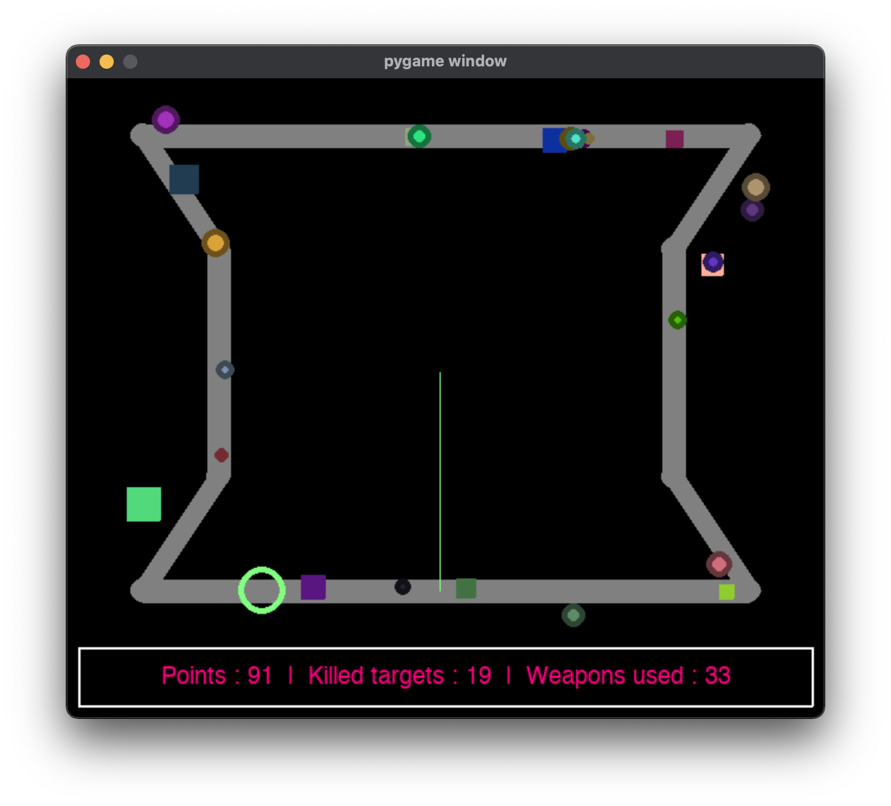

# About

A small pygame program using steering behaviors.

# The game

The game contains two types of vehicle (weapons and targets):

- The targets are generated by the game every 40 ticks. They must be killed using weapons. The targets can be either circles or squares, they have random shapes and colors.
- The weapons are generated by the user by clicking on a position in the screen. They are used to kill the targets by colliding with them. The weapons have a shape of a red triangle and can have different sizes.

The game contains a track that is by default motionless. The user can make the track move slightly at every tick by clicking the **`T`** button. They can stop the movement by clicking the same button again. To reset the initial (default) state of the track, the user can press the **`R`** button.

The score of the user is shown at the bottom of the game screen and gets updated constantly whenever its values changes.

To quit the game, the user can press the key **`Q`** or close the window or terminate the process from the terminal.

# Rules

The game may not be as easy as it seems. there are some rules to follow in order to get the best scores.

- If a weapon collides with a target. A reward of **10** marks is gained.
- if a weapon collides with another weapon. A penalty of **-20** is deducted from the points (we don't want to play with missiles).
- A weapon has an age, and dies when it reaches an age of **100**. If this happens, the weapon disappears and a penalty of **-5** is deducted from the points.

# Additional changes as to the initial version

In addition to all the previous functionalities :
- the code has been optimized by adding a class `Point` to store the coordinates and easily apply operations between multiple instances.
- The code has been cleaned to follow the `PEP8` style guide.
